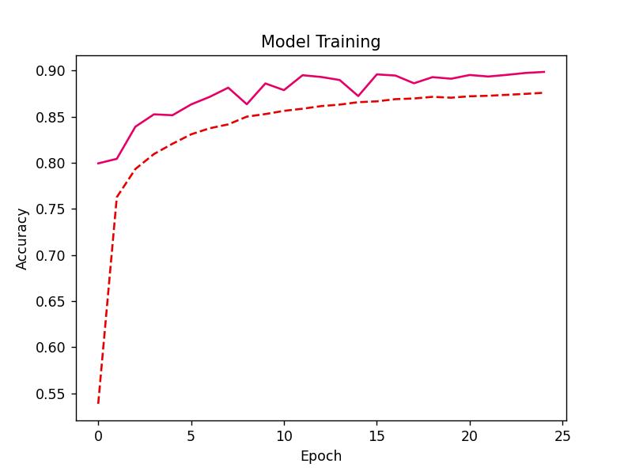
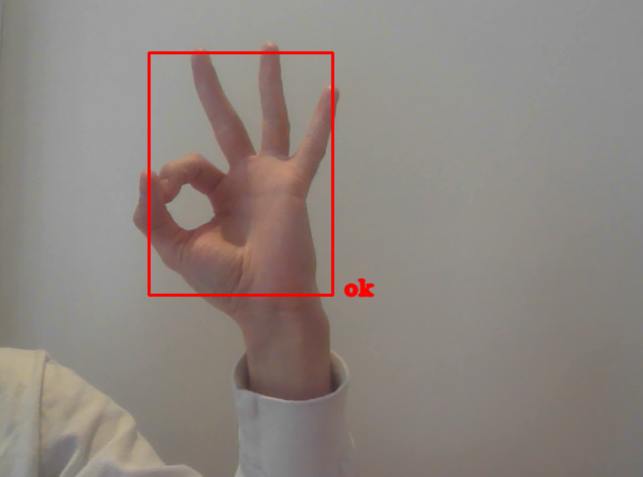

# Hand Gesture Detection
This project was originally made for CSI 4133 to detect live sign language gestures such as fingerspelled letters. Although the original assignment did not require it, I decided to extend the project by implementing my own supervised learning algorithm with Keras. Due to a need for large datasets with high-quality, varied images (and a lack of these for Sign Languages), I opted instead to detect various universal hand gestures (such as the "okay" gesture), on top of a few ASL fingerspelled letters.

Here, the Dashed line indicates accuracy over the Training set and the Solid line indicates accuracy over the Validation set.

This project contains a Feedforward Neural Network trained on over 145,000 images of hands from HaGRID (a varied open source dataset) to classify 29 gestures. The success of this project is promising for the future detection of sign language fingerspelling (which, unlike most signs, are often static gestures), given a sufficently large dataset.

## Architecture
Essentially: raw hand data -> mediapipe -> my model -> live gesture prediction

## Running the Code
You can try the pre-trained model out on your own webcam by executing:
`python predict.py`

## Explanation
File `preprocessing.py` opens the HaGRID dataset (which I have downloaded locally but not upload to this repo) and processes the data with Google MediaPipe Hand Landmark detection. MediaPipe's hand landmark detection can detect 3D points of 21 key landmarks on a hand (eg. Wrist, Index Finger Metacarpals, etc.). So, each hand in each image in HaGRID is stored as sets of points for a total `21*3 = 63` features in X.csv and y.csv. This can easily take over 2 hours for the full dataset.

File `train.py` trains a model, `hand-gestures-29.keras`, on the data and saves it. The data is shuffled and split into train and test data.

File `predict.py` is where the fun really happens. This opens up your webcam, detects your hand and writes on screen what gesture it thinks you are producing.

## References
This project uses the lightweight version 2 HaGRID dataset from: https://github.com/hukenovs/hagrid/tree/master?tab=readme-ov-file

This project uses example MediaPipe Hand Landmark detection code from: https://github.com/google-ai-edge/mediapipe/blob/master/docs/solutions/hands.md#python-solution-api and https://ai.google.dev/edge/mediapipe/solutions/vision/hand_landmarker/python?_gl=1

This project also imports OpenCV, Keras and TensorFlow, and the respective documentation was consulted.

I have used ChatGPT in a limited way to help debug code and provide examples of certain library functionalities, such as how to save a Pandas DataFrame as a .csv file or how to implement a time bar (both done in preprocessing.py).